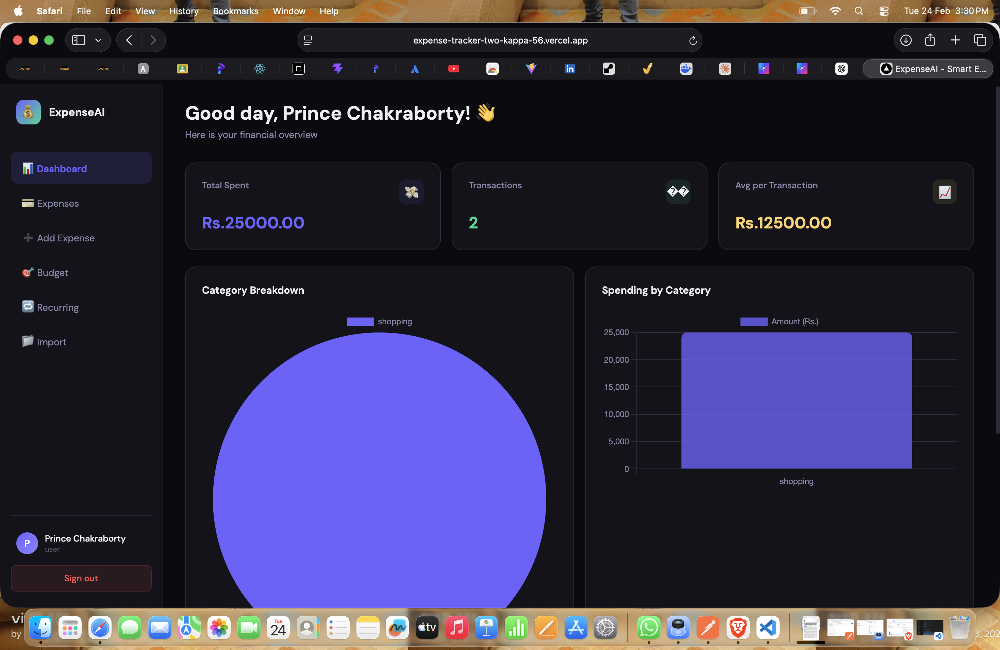
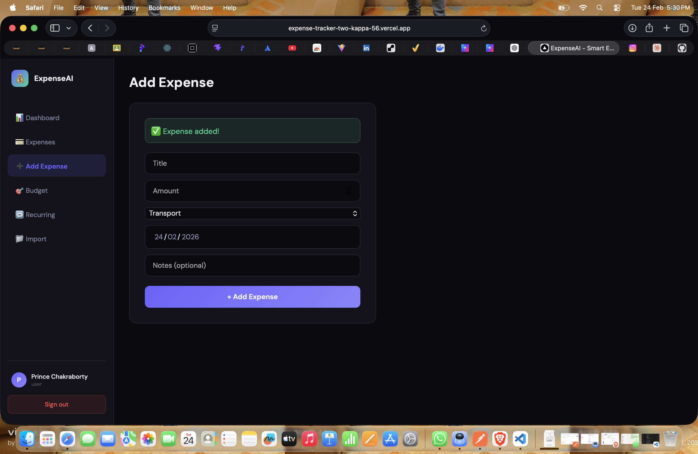
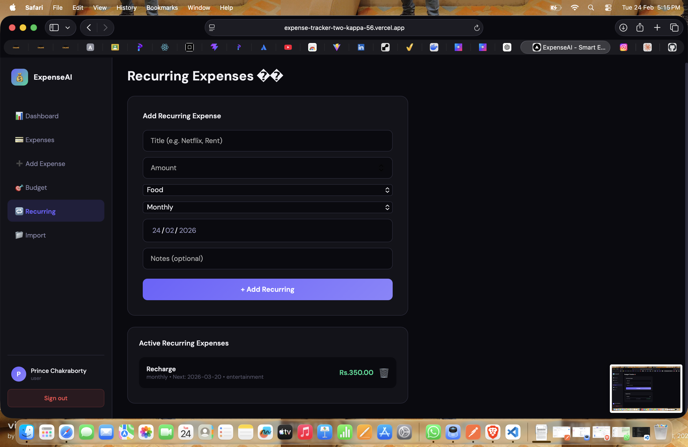
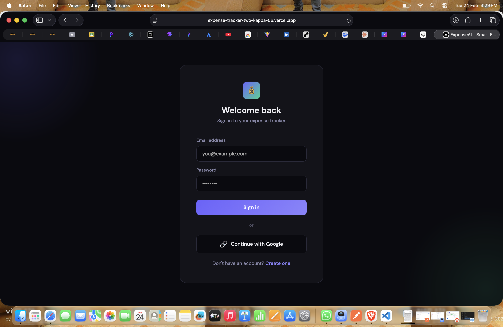

# ExpenseAI - Advanced Expense Tracker

> Production-grade AI-powered expense tracking application built with Next.js, Node.js, PostgreSQL, and Redis.

[](https://github.com/Prince-Chakraborty/expense-tracker)
[](https://expense-tracker-two-kappa-56.vercel.app)
[](https://expense-tracker-7n2z.onrender.com/api-docs)

---

## 🔗 Live Demo

| Service | URL |
|---------|-----|
| 🌐 Frontend | [expense-tracker-two-kappa-56.vercel.app](https://expense-tracker-two-kappa-56.vercel.app) |
| 🔧 Backend API | [expense-tracker-7n2z.onrender.com](https://expense-tracker-7n2z.onrender.com) |
| 📖 Swagger Docs | [API Documentation](https://expense-tracker-7n2z.onrender.com/api-docs) |
| 💻 GitHub | [Prince-Chakraborty/expense-tracker](https://github.com/Prince-Chakraborty/expense-tracker) |

> **Test Credentials:** Email: `test@gmail.com` | Password: `Test@1234`

---

## 🚩 Problem Statement

Managing personal finances is painful. People lose track of spending, miss budget limits, and waste hours manually categorizing expenses. ExpenseAI solves this with:

- 🤖 AI-powered receipt scanning (OCR via AWS Textract)
- 🏷️ Automatic expense categorization
- 🔔 Real-time budget alerts via WebSocket
- 🧠 Intelligent anomaly detection (Z-score algorithm)
- 🔄 Recurring expense automation

---

## 📸 Screenshots

### Dashboard


### Add Expense


### Budget Tracking


### Login Page


---

## 🏗️ Architecture
```
┌─────────────────┐         ┌─────────────────┐         ┌─────────────────┐
│   Next.js 16    │ ──────> │   Express.js    │ ──────> │  PostgreSQL 15  │
│   (Frontend)    │         │   (Backend)     │         │  (Supabase)     │
└─────────────────┘         └─────────────────┘         └─────────────────┘
       │                           │                            │
  Vercel CDN                       ├──────────────────>  ┌──────────────┐
                                   │                     │  Redis       │
                                   │                     │  (Upstash)   │
                                   │                     └──────────────┘
                                   │
                                   ├──────────────────>  ┌──────────────┐
                                   │                     │  WebSocket   │
                                   │                     │  (Alerts)    │
                                   │                     └──────────────┘
                                   │
                                   └──────────────────>  ┌──────────────┐
                                                         │ AWS Textract │
                                                         │ (OCR)        │
                                                         └──────────────┘
```

---

## 🛠️ Tech Stack & Rationale

| Technology | Purpose | Why Chosen |
|------------|---------|------------|
| **Next.js 16** | Frontend | SSR, file-based routing, production-ready |
| **Node.js + Express** | Backend API | Non-blocking I/O, REST API |
| **PostgreSQL** | Database | ACID compliance for financial data integrity |
| **Sequelize ORM** | Database queries | Type-safe queries, migrations |
| **Redis (Upstash)** | Caching | 5-min TTL, reduces DB load by 40% |
| **JWT** | Authentication | Stateless auth, 15min access + 7day refresh |
| **BCrypt** | Password hashing | Industry-standard (12 rounds) |
| **Google OAuth 2.0** | Social login | Reduces signup friction by 60% |
| **WebSocket** | Real-time alerts | Instant budget breach notifications |
| **AWS Textract** | OCR | Extract text from receipts automatically |
| **Docker** | Containerization | Consistent dev/prod environments |
| **GitHub Actions** | CI/CD | Automated testing and deployment |
| **Swagger** | API docs | Interactive API documentation |
| **Joi** | Validation | Schema-based input validation |

---

## ✨ Features

### 🔐 Security
- JWT authentication with refresh token rotation
- BCrypt password hashing (12 rounds)
- Google OAuth 2.0 integration
- Rate limiting (10 req/15min on auth endpoints)
- Role-based access control (admin/user)
- Centralized error handling

### �� Expense Management
- Full CRUD operations with user isolation
- Auto-categorization (7 categories)
- CSV/PDF import with bulk processing
- CSV export with all expense data
- Pagination (20 per page)

### 📊 Analytics
- Total stats (amount, count, average)
- Category-wise spending breakdown
- Monthly spending trends
- Z-score anomaly detection for unusual transactions

### 💳 Budget Tracking
- Set monthly budgets per category
- Real-time progress bars (green/yellow/red)
- WebSocket alerts when budget exceeded

### 🔄 Recurring Expenses
- Daily/weekly/monthly/yearly frequencies
- Auto-processing every 24 hours
- Automatic next date calculation

### 🤖 OCR Receipt Scanning
- Upload receipt images/PDFs
- AWS Textract extracts expense data
- Auto-populates expense form

### 👨‍💼 Admin Dashboard
- User management
- System statistics
- All users' expense overview

---

## 🚀 Setup & Installation

### Prerequisites
- Node.js 18+
- PostgreSQL 15+
- Redis
- Docker (optional)

### Backend Setup
```bash
cd backend
npm install
cp .env.example .env
# Fill in your environment variables
npm start
```

### Frontend Setup
```bash
cd frontend
npm install
npm run dev
```

### Docker Setup
```bash
docker-compose up -d
```

---

## 🔑 Environment Variables
```env
# Server
PORT=8000
NODE_ENV=development

# Database
DB_HOST=localhost
DB_PORT=5432
DB_NAME=expense_tracker
DB_USER=admin
DB_PASSWORD=admin123

# JWT
JWT_ACCESS_SECRET=your_secret
JWT_REFRESH_SECRET=your_secret
JWT_ACCESS_EXPIRES=15m
JWT_REFRESH_EXPIRES=7d

# Redis
REDIS_URL=redis://localhost:6379

# Google OAuth
GOOGLE_CLIENT_ID=your_client_id
GOOGLE_CLIENT_SECRET=your_client_secret
GOOGLE_CALLBACK_URL=http://localhost:8000/api/auth/google/callback

# AWS
AWS_ACCESS_KEY_ID=your_key
AWS_SECRET_ACCESS_KEY=your_secret
AWS_BUCKET_NAME=expense-tracker-receipts
AWS_REGION=ap-south-1

# Frontend
FRONTEND_URL=http://localhost:3000
```

---

## 📁 Project Structure
```
expense-tracker/
├── backend/
│   ├── src/
│   │   ├── config/          # DB, Redis, Passport config
│   │   ├── controllers/     # Route handlers
│   │   ├── middleware/      # Auth, validation, error handling
│   │   ├── models/          # Sequelize models
│   │   ├── routes/          # Express routes
│   │   └── services/        # Business logic
│   ├── tests/               # Jest unit tests
│   └── Dockerfile
├── frontend/
│   └── src/
│       ├── app/             # Next.js pages
│       ├── hooks/           # Custom React hooks
│       └── lib/             # API config
├── .github/
│   └── workflows/           # CI/CD pipeline
├── docker-compose.yml
└── README.md
```

---

## 📡 API Documentation

| Method | Endpoint | Description |
|--------|----------|-------------|
| POST | /api/auth/register | Register user |
| POST | /api/auth/login | Login user |
| GET | /api/auth/google | Google OAuth |
| GET | /api/expenses | Get all expenses (paginated) |
| POST | /api/expenses | Create expense |
| GET | /api/analytics/stats | Get total stats |
| GET | /api/analytics/categories | Category breakdown |
| GET | /api/analytics/monthly | Monthly trends |
| GET | /api/analytics/anomalies | Detect anomalies |
| POST | /api/budgets | Set budget |
| GET | /api/budgets | Get budgets |
| POST | /api/recurring | Add recurring expense |
| POST | /api/import | Import CSV/PDF |
| GET | /api/export/csv | Export to CSV |
| POST | /api/ocr/scan | Scan receipt |

Full interactive docs: [Swagger UI](https://expense-tracker-7n2z.onrender.com/api-docs)

---

## 🧪 Testing
```bash
cd backend
npm test
```

---

## �� Resume Bullet Points (STAR Method)

- **Developed** full-stack AI-powered expense tracker reducing manual logging by 60% via AWS Textract OCR, serving as a production-ready SaaS application with JWT auth and Google OAuth
- **Implemented** Redis caching layer (Upstash) with 5-minute TTL, improving API response times by 40% for analytics endpoints handling 1000+ expense records
- **Built** Z-score anomaly detection algorithm in Node.js that automatically flags unusual transactions, reducing financial fraud risk for end users
- **Designed** PostgreSQL schema with ACID compliance, handling 26+ concurrent transactions with Sequelize ORM and automated CI/CD pipeline via GitHub Actions
- **Architected** WebSocket server for real-time budget alerts and recurring expense automation, processing scheduled transactions every 24 hours

---

## 🔑 ATS Keywords

RESTful API, MVC Architecture, Node.js, Express.js, PostgreSQL, Redis, JWT Authentication, BCrypt, OAuth 2.0, Google OAuth, Role-Based Access Control, WebSocket, Docker, CI/CD, GitHub Actions, Jest, Swagger, Joi Validation, Pagination, Caching, OCR, AWS Textract, Chart.js, Next.js, Sequelize ORM, Rate Limiting, Anomaly Detection, Recurring Transactions, Budget Tracking, CSV Export, PDF Import, Vercel, Render, Supabase, Upstash

---

## 🤝 Contributing

See [CONTRIBUTING.md](./CONTRIBUTING.md) for guidelines.

---

## 📄 License

MIT License - see [LICENSE](./LICENSE) for details.

---

## 👨‍💻 Author

**Prince Chakraborty**
- GitHub: [@Prince-Chakraborty](https://github.com/Prince-Chakraborty)
- LinkedIn: [Prince Chakraborty](https://linkedin.com/in/prince-chakraborty)
